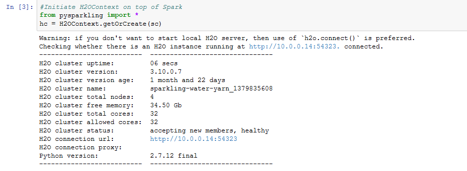
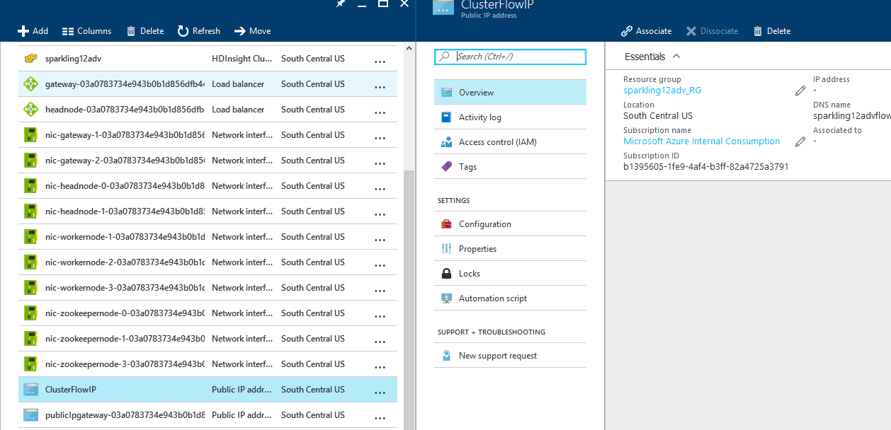
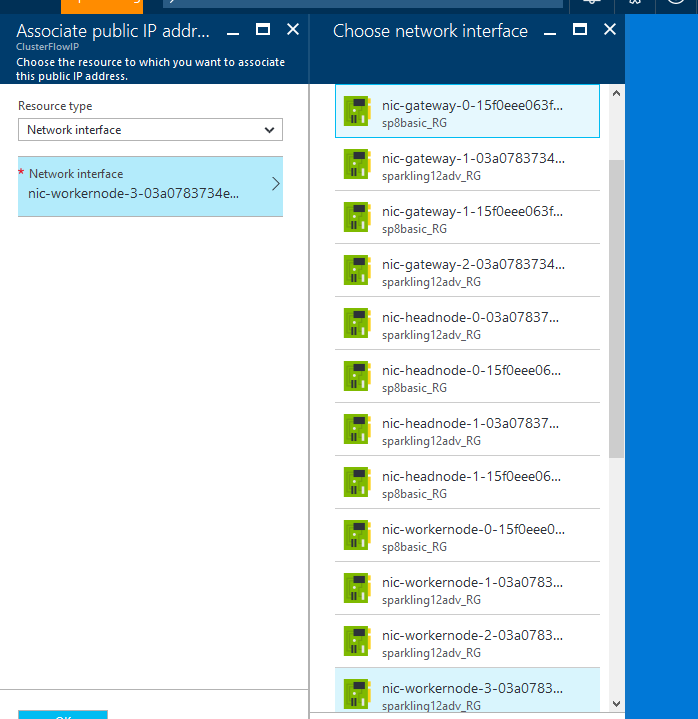
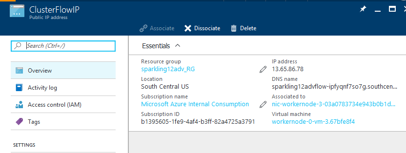

# H2O-SparklingWater-azure-templates

The goal of this repo is to provide an easy (click-and-go) way to deploy H2O Sparkling Water clusters on Microsoft Azure.

There are two kind of templates offered on this repo.

1. Basic: 
	- HDInsight 3.5
	- Spark 1.6.2
	- Latest version of H2O Sparkling water (for spark 1.6)
	- VNet containing all resources
	- Required python packages in each node
	- R open in each node
2. Advanced: 
	- Everything in Basic template plus:
	- Additional data source (Linked Storage Account) - pre-requisite
	- External Hive/Oozie Metastore (SQL Database) - pre-requisite
	
It takes about 20 minutes to create the cluster.

## Next Step: Run pySparkling Notebook Examples:

Open your browser and go to:
> `https://CLUSTERNAME.azurehdinsight.net/jupyter`

Insert the username (<b>hdiadmin</b> by default) and password to your cluster. 

You will see in Jupyter a new folder "H2O-PySparkling-Examples" with a couple of notebooks you can run. Make sure that you set the right configuration on the first cell of the notebooks based on the sizes of your cluster nodes.

## Azure HDInsight Architecture

Azure HDInsight Spark Clusters (Spark on YARN) come with: 
Head node (2), Worker node (1+), Zookeeper node (3) (Free for A1 Zookeepers VM size)

Hadoop supports a notion of the default file system. The default file system implies a default scheme and authority. It can also be used to resolve relative paths. During the HDInsight creation process, an Azure Storage account and a specific Azure Blob storage container from that account is designated as the default file system.

For the files on the default file system, you can use a relative path or an absolute path. For example, the *hadoop-mapreduce-examples.jar* file that comes with HDInsight clusters can be referred to by using one of the following:

	wasbs://mycontainer@myaccount.blob.core.windows.net/example/jars/hadoop-mapreduce-examples.jar
	wasbs:///example/jars/hadoop-mapreduce-examples.jar
	/example/jars/hadoop-mapreduce-examples.jar

In addition to this storage account, you can add additional storage accounts (<b>Advanced Template)</b> from the same Azure subscription or different Azure subscriptions during the creation process or after a cluster has been created. Note that the additional storage account must be in the same region thatn the HDI cluster. <b>Normally this is where your big data resides</b>. The syntax is:

	wasb[s]://<containername>@<accountname>.blob.core.windows.net/<path>
	
HDInsight provides  also access to the distributed file system that is locally attached to the compute nodes (disks on the cluster nodes). You can use this as a local cache. Remember that this file system is gone once you delete the cluster. This file system can be accessed by using the fully qualified URI, for example:

	hdfs://<namenodehost>/<path>
	
Most HDFS commands (for example, <b>ls</b>, <b>copyFromLocal</b> and <b>mkdir</b>) still work as expected. Only the commands that are specific to the native HDFS implementation (which is referred to as DFS), such as <b>fschk</b> and <b>dfsadmin</b>, will show different behavior in Azure Blob storage.

The cluster can also access any Blob storage containers that are configured with full public read access or public read access for blobs only.

Only the data on the linked storage account and the external hive meta-store will persist after the cluster is deleted. 

### Hive Metastore

The metastore contains Hive metadata, such as Hive tables, partitions, schemas, and columns. The metastore helps you to retain your Hive and Oozie metadata. If you are familiar with Databricks and their concept of Tables, then a custom Hive Metastore is the same thing: a persistent database to store Hive tables.

<b>On the Basic Tamplate: </b>  
By default, Hive uses an embedded Azure SQL database to store this information. The embedded database can't preserve the metadata when the cluster is deleted. The Hive metastore that comes by default when HDInsight is deployed is transient. When the cluster is deleted, Hive metastore gets deleted as well. 

<b>On the Advanced Template: </b>  
An external Azure SQL DB is linked to store the Hive metastore so that it persists even when the cluster is blown away.  For example, if you create Hive tables in a cluster created with an external Hive metastore, you can see those tables if you delete and re-create the cluster with the same Hive metastore.

> When you're creating a custom metastore, do not use a database name that contains dashes or hyphens because this can cause the cluster creation process to fail.

## H2O Sparkling Water Architecture

Both templates will automatically download the latest version of Sparkling Water compatible with Spark 1.6.
It will also copy the sparkling water folder on the default storage under /HdiNotebooks/H2O-Sparkling-Water/.

H2O can be installed as a standalone cluster, on top of YARN, and on top of spark on top of YARN.
Both templates introduced in this repo install H2O on top of Spark on top of YARN => Sparkling Water on YARN.

Note that all spark applications deployed using a Jupyter Notebook will have "yarn-cluster" deploy-mode. This means that the spark driver node can be allocated on any worker node of the cluster, not on the head nodes.

### How do I see the H2O Flow UI?

Both Basic and Advanced templates have to be manually tweeked in the azure portal in order to allow http access to the VM where the spark driver falls (the only VM that provides the FLOW portal). <b>Note: the spark driver can change to any worker node each time you open/run a notebook (submit application).</b>

This is what you need to do: 
In the notebook, once you create the h2o context, you will see an output like this:

1. Write down or memorize the IP address and port of the "H2O connection URL".

2. Now open the azure portal -> open the resource group of the cluster you created -> click on the VNET and memorize what worker node has the IP on step 1.

3. Now go back to the resource group list of resources and select the "ClusterFlowIP" resource -> Click on "Associate".

4. On the "Associate" blade select Resource type: Network Interface -> then select from the list the NIC of the worker node on step 2 -> click OK.

5. Refresh the "ClusterFlowIP" resource blade and copy the IP address under "Essentials".

6. On your browser open: http://[publicIP]:port  and you will see the FLOW UI

## Create Jupyter notebook with PySpark kernel 

HDInsight Spark clusters provide two kernels that you can use with the Jupyter notebook. These are:

* **PySpark** (for applications written in Python)
* **Spark** (for applications written in Scala)

Couple of key benefits of using the PySpark kernel are:

* You do not need to set the contexts for Spark and Hive. These are automatically set for you.
* You can use cell magics, such as `%%sql`, to directly run your SQL or Hive queries, without any preceding code snippets.
* The output for the SQL or Hive queries is automatically visualized.

1. From the [Azure Portal](https://portal.azure.com/), from the startboard, click the tile for your Spark cluster (if you pinned it to the startboard). You can also navigate to your cluster under **Browse All** > **HDInsight Clusters**.   

2. From the Spark cluster blade, click **Quick Links**, and then from the **Cluster Dashboard** blade, click **Jupyter Notebook**. If prompted, enter the admin credentials for the cluster.

	> you may also reach the Jupyter Notebook for your cluster by opening the following URL in your browser. Replace __CLUSTERNAME__ with the name of your cluster:
	>
	> `https://CLUSTERNAME.azurehdinsight.net/jupyter`

## Where are the notebooks stored?

Jupyter notebooks are saved to the storage account associated with the cluster under the **/HdiNotebooks** folder.  Notebooks, text files, and folders that you create from within Jupyter will be accessible from WASB.  For example, if you use Jupyter to create a folder **myfolder** and a notebook **myfolder/mynotebook.ipynb**, you can access that notebook at `wasbs:///HdiNotebooks/myfolder/mynotebook.ipynb`.  The reverse is also true, that is, if you upload a notebook directly to your storage account at `/HdiNotebooks/mynotebook1.ipynb`, the notebook will be visible from Jupyter as well.  Notebooks will remain in the storage account even after the cluster is deleted.

The way notebooks are saved to the storage account is compatible with HDFS. So, if you SSH into the cluster you can use file management commands like the following:

	hdfs dfs -ls /HdiNotebooks             				  # List everything at the root directory – everything in this directory is visible to Jupyter from the home page
	hdfs dfs –copyToLocal /HdiNotebooks    				# Download the contents of the HdiNotebooks folder
	hdfs dfs –copyFromLocal example.ipynb /HdiNotebooks   # Upload a notebook example.ipynb to the root folder so it’s visible from Jupyter

In case there are issues accessing the storage account for the cluster, the notebooks are also saved on the headnode `/var/lib/jupyter`.

## Delete the cluster

To delete the Sparkling Water Cluster, go to the Azure portal and delete the Resource Group.

##What components are included as part of a Spark cluster?

Spark in HDInsight includes the following components that are available on the clusters by default.

- [Spark Core](https://spark.apache.org/docs/1.5.1/). Includes Spark Core, Spark SQL, Spark streaming APIs, GraphX, and MLlib.
- [Anaconda](http://docs.continuum.io/anaconda/)
- [Livy](https://github.com/cloudera/hue/tree/master/apps/spark/java#welcome-to-livy-the-rest-spark-server)
- [Jupyter Notebook](https://jupyter.org)

Spark in HDInsight also provides an [ODBC driver](http://go.microsoft.com/fwlink/?LinkId=616229) for connectivity to Spark clusters in HDInsight from BI tools such as Microsoft Power BI and Tableau.

